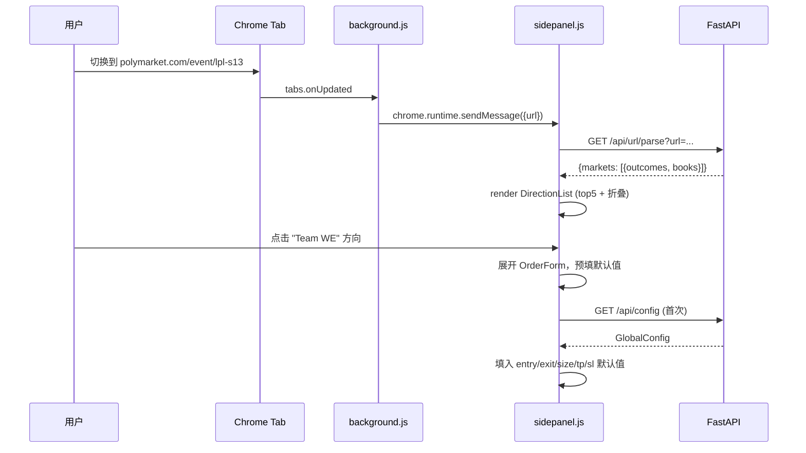
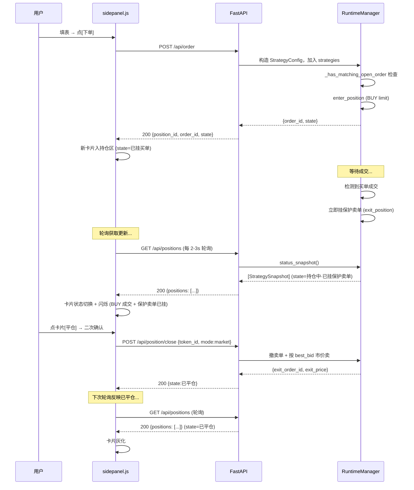
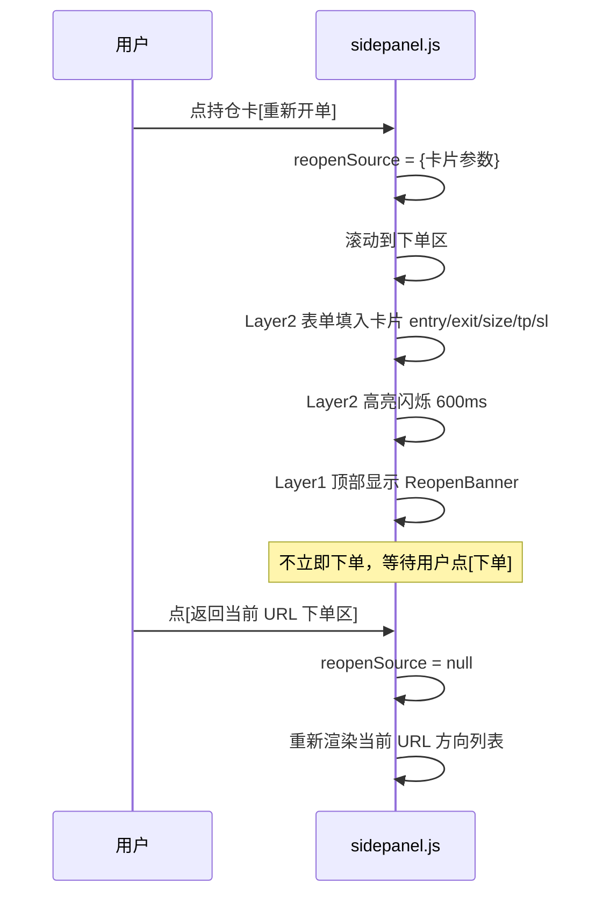
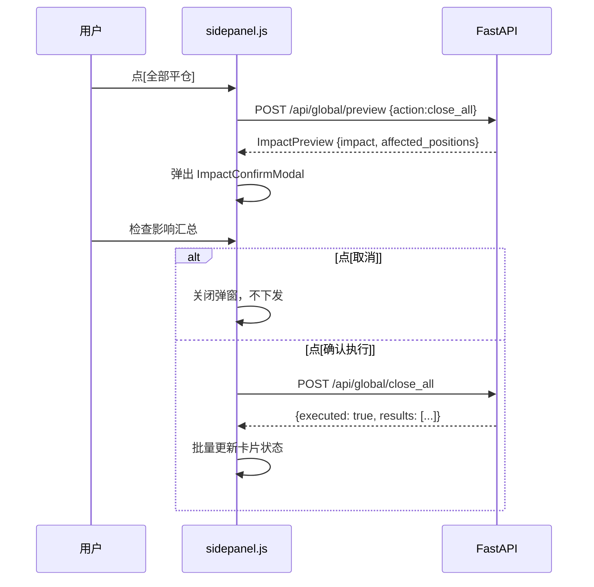
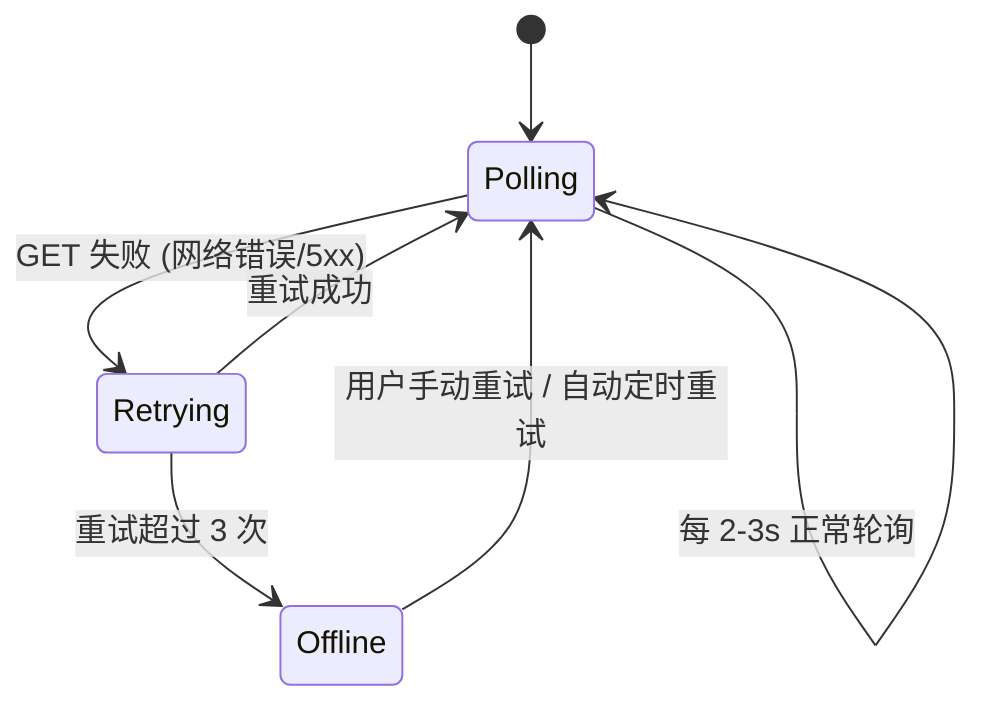
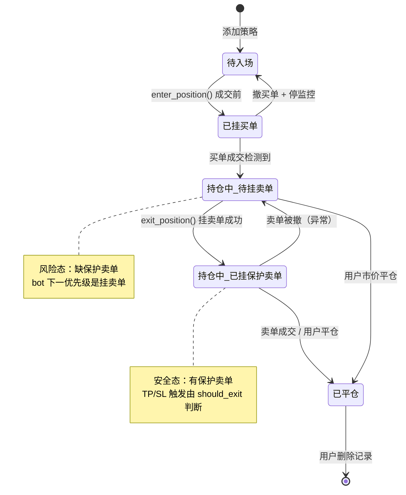

# Polymarket 交易助手 Chrome 侧边栏扩展 — 详细设计文档

> 配套交付物：
> - [静态浏览器扩展原型.html](file:///d:/workspace/python/polymarket_trading_bot_strategy/静态浏览器扩展原型.html) — 纯视觉静态原型
> - [动态浏览器扩展原型.html](file:///d:/workspace/python/polymarket_trading_bot_strategy/动态浏览器扩展原型.html) — 交互式原型
>
> 本文档描述的是**目标产品形态**，当前阶段仅产出前端原型与设计契约，**不修改任何 Python 代码**，**不实现 FastAPI 后端**，**不构建真实 Chrome 扩展工程**。

---

## 1. 背景与目标

### 1.1 项目背景

现有项目 [polymarket_trading_bot_strategy](file:///d:/workspace/python/polymarket_trading_bot_strategy/) 是一个 Python 编写的 Polymarket CLOB 自动交易机器人，核心模块包括：

| 模块 | 文件 | 职责 |
|---|---|---|
| 入口 | [main.py](file:///d:/workspace/python/polymarket_trading_bot_strategy/main.py) | 启动交互式配置 + RuntimeManager |
| 运行时 | [runtime.py](file:///d:/workspace/python/polymarket_trading_bot_strategy/runtime.py) | `StrategyRuntime` / `RuntimeManager`，5 状态机 + 心跳 + 快照 |
| 交易 | [trading.py](file:///d:/workspace/python/polymarket_trading_bot_strategy/trading.py) | CLOB 客户端、下单、撤单、盘口查询 |
| 策略 | [strategy.py](file:///d:/workspace/python/polymarket_trading_bot_strategy/strategy.py) | `should_enter` / `should_exit`，TP/SL 触发价 |
| 配置 | [config.py](file:///d:/workspace/python/polymarket_trading_bot_strategy/config.py) | `Config` / `StrategyConfig`，env + config.json |
| 市场解析 | [market_setup.py](file:///d:/workspace/python/polymarket_trading_bot_strategy/market_setup.py) | URL → slug → Gamma API → markets/outcomes/token_ids |
| 安全约束 | [docs/polymarket-knowledge.md](file:///d:/workspace/python/polymarket_trading_bot_strategy/docs/polymarket-knowledge.md) | 强制 EXIT_PRICE、防重复下单、意图指纹、不基于仓位差自动卖 |

当前机器人的操作入口是 CLI 交互式配置 + Telegram 命令 bot，缺少一个**可视化的、与浏览器页面联动的操作面板**。用户在浏览 Polymarket 网页时，希望快速对当前页面的市场下单、管理已有持仓、批量执行全局指令，因此需要一个 Chrome 侧边栏扩展。

### 1.2 目标用户与场景

- **用户**：Polymarket 电竞/事件交易玩家，已运行上述 Python bot，持有钱包与 USDC。
- **核心场景**：
  1. 浏览 `polymarket.com/event/<slug>` 时，侧边栏自动解析当前页面所有可下注方向，按全局默认配置预填买入价/卖出价/数量/止盈止损，用户确认后一键下单。
  2. 在侧边栏查看所有持仓（来自 `RuntimeManager` 的快照），按状态对每张卡片执行停止/平仓/重新开单/删除。
  3. 通过全局指令栏一键停止/平仓/删除所有策略，操作前必须看到影响汇总并二次确认。
  4. 持仓卡片的"重新开单"不立即下单，而是把参数注入下单区等待用户最终确认。

### 1.3 范围与非目标

**范围（本扩展要做）**：
- 解析当前 tab URL，渲染可下注方向列表（top 5 + 折叠更多）。
- 下单表单（与 `StrategyConfig` 字段对齐），预填全局默认值。
- 持仓卡片列表（与 `StrategyRuntime.snapshot()` 对齐），按状态显示 Action。
- 全局指令（全部停止 / 全部平仓 / 全部删除），二次确认 + 影响汇总。
- 状态区聚合（持仓单数 / 总额 / PNL / 连接状态）。
- HTTP 全量轮询（持仓/订单/状态，扩展端定时拉取，无 WebSocket）。

**非目标（本扩展不做）**：
- **不直连 Polymarket**：所有读写必须经 FastAPI 桥接，复用 bot 的安全逻辑。
- **不绕过 bot 的安全检查**：扩展只发指令，是否下单/撤单由 bot 决定。
- **不持久化策略配置**：策略列表纯内存（对齐 `market_setup.run_interactive_setup` 的内存模式），扩展端不写本地存储。
- **不接管 Telegram bot**：扩展与 Telegram bot 是并列的操作入口，共享同一 `RuntimeManager`。
- **不做 K 线/深度图**：扩展是操作面板，不是行情终端。

---

## 2. 总体架构

### 2.1 架构图

```
┌───────────────────────┐        ┌──────────────────────┐        ┌──────────────────────┐
│  Chrome Side Panel    │  HTTP  │  FastAPI Bridge      │  in-proc│  Python Bot Core     │
│  (扩展前端)            │ ─────►│  (新增，仅契约)       │ ──────►│  runtime / trading   │
│                       │ ◄─────│  /api/*              │ ◄──────│  strategy / config   │
│  - 状态区             │ (轮询) │                      │        │  market_setup        │
│  - 下单区             │ 2-3s   │  - 读: snapshot()    │        │                      │
│  - 持仓区             │        │  - 写: 下单/撤单/平仓 │        │  ┌────────────────┐  │
│  - 全局指令           │        │  - 无 WS/SSE         │        │  │  Polymarket    │  │
└───────────┬───────────┘        └──────────┬───────────┘        │  │  CLOB / Gamma  │  │
            │                               │                    │  │  / data-api    │  │
            │ chrome.tabs.onUpdated         │ RuntimeManager     │  └────────────────┘  │
            ▼                               ▼ singleton           └──────────────────────┘
┌───────────────────────┐        ┌──────────────────────┐
│  Polymarket Web Page  │        │  RuntimeManager      │
│  (用户浏览的页面)      │        │  (单例，进程内共享)   │
│  polymarket.com/...   │        │  - strategies[]      │
└───────────────────────┘        │  - order_lock        │
                                 │  - status_snapshot() │
                                 └──────────────────────┘
```

### 2.2 关键约束

| 约束 | 说明 | 依据 |
|---|---|---|
| 扩展不直连 Polymarket | 所有读写经 FastAPI，复用 bot 的 CLOB 客户端与安全逻辑 | 避免重复实现签名/防重复/TP/SL |
| 策略配置纯内存 | 扩展端不写 localStorage / indexedDB，刷新即重读 FastAPI | 对齐 [market_setup.py](file:///d:/workspace/python/polymarket_trading_bot_strategy/market_setup.py) 的内存模式 |
| FastAPI 与 bot 同进程 | FastAPI 持有 `RuntimeManager` 单例引用，不通过文件/IPC 通信 | 保证指令即时生效，避免双写 |
| 强制 EXIT_PRICE | 下单接口校验 `exit_price` 必填，否则 400 | [docs/polymarket-knowledge.md](file:///d:/workspace/python/polymarket_trading_bot_strategy/docs/polymarket-knowledge.md) 强制卖单保护 |
| 防重复下单 | 下单前由 bot 的 `_has_matching_open_order` 检查，扩展不绕过 | 防重复下单教训 |
| 不基于仓位差自动卖 | 扩展的"平仓"是用户显式指令，不监听仓位变化自动卖 | 手动买入自动卖出事故 |
| 二次确认 | 全局指令必须先 `POST /api/global/preview` 返回影响汇总，扩展展示后用户确认才下发 | 用户需求 |

### 2.3 数据流

**读流（扩展 ← FastAPI ← bot）**：
- `GET /api/positions` → `RuntimeManager.status_snapshot()` 聚合所有 `StrategyRuntime.snapshot()`
- `GET /api/url/parse?url=` → 复用 `market_setup.extract_slug` + `fetch_markets` + `fetch_token_price`
- `GET /api/config` → `Config` 的默认值部分
- `GET /api/status` → 聚合（单数/总额/PNL），PNL 用 `data-api.polymarket.com/positions` 的 mark price

**写流（扩展 → FastAPI → bot）**：
- `POST /api/order` → 构造 `StrategyConfig` 注入 `RuntimeManager`，触发 `enter_position`
- `POST /api/order/cancel` → `trading.cancel_order` 或 `cancel_open_orders_for_token`
- `POST /api/position/close` → 撤该 token 所有卖单 + 按 best_bid 市价卖
- `POST /api/position/stop` → 撤单 + 停监控（`enabled=false`）
- `POST /api/position/delete` → 从 `RuntimeManager.strategies` 移除
- `POST /api/global/*` → 批量调用上述接口

**轮询流（扩展端定时拉取，无 WebSocket）**：
- 扩展端每 2-3s 调 `GET /api/positions` 全量同步所有策略 `snapshot()`（状态切换/持仓变化/cycle 递增均通过 diff 体现）
- 扩展端每 2-3s 调 `GET /api/status` 全量同步聚合状态（对齐 `STATUS_EVERY_CYCLES` 的周期心跳）
- 扩展端按需调 `GET /api/orders` 同步挂单状态（新挂/撤销）
- 成交通知不单独推送，由 `GET /api/positions` 的持仓变化 + `GET /api/orders` 的挂单变化体现
- 首次加载立即调 `GET /api/positions` 全量同步

---

## 3. FastAPI 接口设计

> 本节仅描述**接口契约**，不提供 FastAPI 实现代码。所有字段名严格对齐现有 Python 代码。

### 3.1 REST 接口列表

| Method | Path | 请求 | 响应 | 说明 |
|---|---|---|---|---|
| GET | `/api/health` | — | `{status, bot_running, strategies_count, latency_ms}` | 健康检查 |
| GET | `/api/config` | — | `GlobalConfig` | 全局默认配置 |
| GET | `/api/url/parse` | `?url=<polymarket_url>` 或 `?slug=<slug>` | `{slug, event_title, markets: [MarketInfo]}` | 解析 URL 或 slug（支持手动输入） |
| GET | `/api/markets/{slug}` | — | `MarketInfo` | 市场详情（单 market） |
| GET | `/api/positions` | — | `{positions: [StrategySnapshot]}` | 所有策略快照 |
| GET | `/api/orders` | — | `{orders: [OrderInfo]}` | 所有挂单 |
| GET | `/api/status` | — | `StatusAggregate` | 聚合状态 |
| POST | `/api/order` | `OrderRequest` | `{position_id, order_id, state}` | 下单 |
| POST | `/api/order/cancel` | `{order_id? \| token_id+side}` | `{cancelled: [order_id]}` | 撤单 |
| POST | `/api/position/close` | `{token_id, mode}` | `{order_id, exit_price, size}` | 平仓 |
| POST | `/api/position/stop` | `{token_id}` | `{cancelled_orders, state}` | 停止策略 |
| POST | `/api/position/delete` | `{token_id}` | `{removed: true}` | 删除策略记录 |
| POST | `/api/global/preview` | `{action: stop_all\|close_all\|delete_all}` | `ImpactPreview` | 预览影响（不下发） |
| POST | `/api/global/stop_all` | — | `ImpactPreview` + 执行结果 | 全部停止 |
| POST | `/api/global/close_all` | — | `ImpactPreview` + 执行结果 | 全部平仓 |
| POST | `/api/global/delete_all` | — | `ImpactPreview` + 执行结果 | 全部删除 |

### 3.2 接口请求/响应示例

#### GET `/api/health`

```http
GET /api/health
```

```json
{
  "status": "ok",
  "bot_running": true,
  "strategies_count": 3,
  "latency_ms": 12,
  "funder": "0x1234...abcd"
}
```

#### GET `/api/config`

返回 `Config` 的默认值部分（对齐 [config.py:109-134](file:///d:/workspace/python/polymarket_trading_bot_strategy/config.py#L109-L134)）。

```json
{
  "trading_enabled": true,
  "poll_interval": 1,
  "conditional_entry": true,
  "default_entry_price": 0.50,
  "default_exit_price": 0.55,
  "default_share_amount": 10.0,
  "default_take_profit_pct": null,
  "default_stop_loss_pct": null
}
```

> `conditional_entry` 仅由 `.env` 控制，扩展端只读不可改（对齐项目硬约束）。

#### GET `/api/url/parse?url=`

复用 [market_setup.py](file:///d:/workspace/python/polymarket_trading_bot_strategy/market_setup.py) 的 `extract_slug` + `fetch_markets` + `fetch_token_price`。

```http
GET /api/url/parse?url=https://polymarket.com/event/lpl-s13-finals
```

```json
{
  "slug": "lpl-s13-finals",
  "event_title": "LPL S13 决赛",
  "markets": [
    {
      "question": "LPL S13 决赛：Team WE vs Team IG 胜者",
      "event_title": "LPL S13 决赛",
      "outcomes": ["Team WE", "Team IG"],
      "clob_token_ids": ["72123...abc", "72123...def"],
      "tick_size": 0.01,
      "closed": false,
      "accepting": true,
      "end_date": "2026-08-15T12:00:00Z",
      "books": [
        {"token_id": "72123...abc", "best_bid": 0.42, "best_ask": 0.44},
        {"token_id": "72123...def", "best_bid": 0.55, "best_ask": 0.57}
      ]
    }
  ]
}
```

#### GET `/api/positions`

对齐 [runtime.py:681-695](file:///d:/workspace/python/polymarket_trading_bot_strategy/runtime.py#L681-L695) 的 `snapshot()`。

```json
{
  "positions": [
    {
      "label": "LPL S13 决赛 [Team WE]",
      "token_id": "72123...abc",
      "state": "持仓中（已挂保护卖单）",
      "cycle": 42,
      "entry_price": 0.42,
      "exit_price": 0.55,
      "share_amount": 100,
      "take_profit_pct": 0.10,
      "stop_loss_pct": 0.05,
      "position_size": 100,
      "avg_price": 0.4200,
      "closed": false
    }
  ]
}
```

#### GET `/api/status`

```json
{
  "position_count": 3,
  "total_cost_usdc": 145.20,
  "current_value_usdc": 157.60,
  "pnl_usdc": 12.40,
  "pnl_pct": 8.54,
  "connection": {"online": true, "latency_ms": 12},
  "bot_running": true,
  "cycle": 1024
}
```

- `total_cost_usdc = Σ position_size * avg_price`
- `current_value_usdc = Σ position_size * mark_price`（mark 来自 `data-api.polymarket.com/positions`）
- `pnl_usdc = current_value_usdc - total_cost_usdc`

#### POST `/api/order`

请求体对齐 [config.py:73-87](file:///d:/workspace/python/polymarket_trading_bot_strategy/config.py#L73-L87) 的 `StrategyConfig`。

```http
POST /api/order
Content-Type: application/json

{
  "token_id": "72123...abc",
  "label": "LPL S13 决赛 [Team WE]",
  "entry_price": 0.42,
  "exit_price": 0.55,
  "share_amount": 100,
  "take_profit_pct": 0.10,
  "stop_loss_pct": 0.05,
  "enabled": true
}
```

**校验规则**（FastAPI 端，对齐项目硬约束）：
- `exit_price` 必填且 > 0，否则 `400 {"error": "EXIT_PRICE_REQUIRED"}`
- `entry_price` 必填且 ∈ (0, 1)
- `share_amount` 必填且 > 0
- bot 端 `_has_matching_open_order` 检查通过后才下单，否则 `409 {"error": "DUPLICATE_ORDER"}`

```json
{
  "position_id": "p_20260724_001",
  "order_id": "0xorder...123",
  "state": "已挂买单（待成交）"
}
```

#### POST `/api/order/cancel`

```http
POST /api/order/cancel
{"order_id": "0xorder...123"}
```

或按 token + side：

```json
{"token_id": "72123...abc", "side": "BUY"}
```

```json
{"cancelled": ["0xorder...123"]}
```

#### POST `/api/position/close`

```http
POST /api/position/close
{"token_id": "72123...abc", "mode": "market"}
```

`mode` ∈ `market`（按 best_bid 立即卖）/ `limit`（按 exit_price 挂限价卖单）。

```json
{
  "cancelled_orders": ["0xsell...456"],
  "exit_order_id": "0xexit...789",
  "exit_price": 0.48,
  "size": 100,
  "state": "已平仓"
}
```

#### POST `/api/global/preview`

```http
POST /api/global/preview
{"action": "close_all"}
```

```json
{
  "action": "close_all",
  "impact": {
    "cancel_sell_orders": 3,
    "market_sell_positions": 3,
    "estimated_recover_usdc": 142.80,
    "current_mark_usdc": 145.20,
    "slippage_risk_usdc": 2.30
  },
  "affected_positions": [
    {"label": "LPL S13 决赛 [Team WE]", "token_id": "72123...abc", "size": 100, "avg_price": 0.42}
  ]
}
```

### 3.3 轮询策略

扩展端通过定时调 GET 接口全量同步状态，**不使用 WebSocket / SSE**，bridge 不维护事件队列、不推送。

| 轮询项 | 接口 | 建议频率 | 说明 |
|---|---|---|---|
| 持仓列表 | `GET /api/positions` | 每 2-3s | 全量 `StrategySnapshot[]`，扩展端 diff 后更新 UI |
| 聚合状态 | `GET /api/status` | 每 2-3s（或更低） | 单数/总额/PNL |
| 挂单列表 | `GET /api/orders` | 每 5s（或按需） | 全量 `OrderInfo[]` |
| 健康检查 | `GET /api/health` | 每 10s | 连接状态徽章 |

- **首次加载**：扩展端打开侧边栏立即调 `GET /api/positions` 全量同步。
- **不引入服务端事件队列/序号**：全量轮询无需增量机制。
- **频率依据**：bot 默认 `POLL_INTERVAL=30s`，fill 检测每 cycle 一次；扩展端轮询 2-3s 可在 bot cycle 间隔内及时反映变化，同时避免压垮 bridge。
- **降级**：bridge 不可达时扩展端进入只读模式（见 7.5 轮询降级）。

### 3.4 错误码

| HTTP | code | 含义 | 扩展端处理 |
|---|---|---|---|
| 400 | `EXIT_PRICE_REQUIRED` | 缺少 exit_price | 表单标红 + toast |
| 400 | `INVALID_PRICE` | 价格越界 (0,1) | 表单标红 |
| 409 | `DUPLICATE_ORDER` | 已有同意图挂单 | 提示"已有挂单" + 跳转该卡片 |
| 409 | `MARKET_CLOSED` | 市场已关闭/结算中 | 禁用下单按钮 |
| 409 | `INSUFFICIENT_BALANCE` | 余额不足 | 提示 + 禁用下单 |
| 409 | `TRADING_DISABLED` | `trading_enabled=false` | 提示 + 禁用下单 |
| 422 | `TOKEN_NOT_FOUND` | token_id 无效 | 提示重新解析 URL |
| 500 | `BOT_ERROR` | bot 内部异常 | 显示错误 + 建议查看 bot 日志 |
| 503 | `CLOB_UNAVAILABLE` | CLOB 不可达 | 顶部显示离线徽章 |

**重试策略**：GET 请求失败时指数退避重试 3 次（200ms / 600ms / 1.8s）；POST 请求不自动重试，由用户决定。

---

## 4. 数据模型

### 4.1 StrategySnapshot

对齐 [runtime.py:681-695](file:///d:/workspace/python/polymarket_trading_bot_strategy/runtime.py#L681-L695) 的 `snapshot()` 返回值。

```typescript
interface StrategySnapshot {
  label: string;              // "{event_title} [{outcome}]"
  token_id: string;           // CLOB outcome token id
  state: StrategyState;       // 5 状态枚举
  cycle: number;              // 策略循环计数
  entry_price: number;        // 配置的买入价
  exit_price: number;         // 配置的卖出价（强制必填）
  share_amount: number;       // 配置的下单数量
  take_profit_pct: number | null;  // 止盈比例，null=关闭
  stop_loss_pct: number | null;    // 止损比例，null=关闭
  position_size: number;      // 当前持仓数量
  avg_price: number;          // 持仓均价
  closed: boolean;            // 是否已平仓
}

type StrategyState =
  | "待入场"
  | "已挂买单（待成交）"
  | "持仓中（待挂卖单）"
  | "持仓中（已挂保护卖单）"
  | "已平仓";
```

### 4.2 MarketInfo

对齐 [market_setup.py:266-280](file:///d:/workspace/python/polymarket_trading_bot_strategy/market_setup.py#L266-L280) 的 `_normalize_market`。

```typescript
interface MarketInfo {
  question: string;           // 市场问题
  event_title: string;        // 所属事件标题
  outcomes: string[];         // 结果选项名（如 ["Team WE", "Team IG"]）
  clob_token_ids: string[];   // 与 outcomes 一一对应的 token id
  tick_size: number;          // 价格最小变动
  closed: boolean;            // 是否已关闭
  accepting: boolean;         // 是否接受下单
  end_date: string;           // 结束时间 ISO8601
  books?: BookInfo[];         // 可选：附带的盘口快照
}

interface BookInfo {
  token_id: string;
  best_bid: number | null;
  best_ask: number | null;
}
```

### 4.3 OrderInfo

对齐 [trading.py:330-336](file:///d:/workspace/python/polymarket_trading_bot_strategy/trading.py#L330-L336) 的 `_order_to_dict` 输出（CLOB V2 Order 对象字段）。

```typescript
interface OrderInfo {
  id: string;                 // 订单 ID
  token_id: string;           // outcome token
  side: "BUY" | "SELL";
  price: number;              // 限价
  size: number;               // 原始数量
  size_matched: number;       // 已成交
  status: "live" | "matched" | "canceled" | "expired";
  created_at: number;         // 毫秒时间戳
}
```

### 4.4 PositionInfo

对齐 `data-api.polymarket.com/positions` 返回（用于 PNL 与持仓校验）。

```typescript
interface PositionInfo {
  token_id: string;
  size: number;               // 当前持仓数量
  avg_price: number;          // 均价
  current_price: number;      // mark price
  value_usdc: number;         // size * current_price
  realized_pnl: number;
  outcome: string;
}
```

### 4.5 GlobalConfig

对齐 [config.py:109-134](file:///d:/workspace/python/polymarket_trading_bot_strategy/config.py#L109-L134)。

```typescript
interface GlobalConfig {
  trading_enabled: boolean;
  poll_interval: number;          // 秒
  conditional_entry: boolean;     // .env only，只读
  default_entry_price: number;
  default_exit_price: number;
  default_share_amount: number;
  default_take_profit_pct: number | null;
  default_stop_loss_pct: number | null;
}
```

### 4.6 ImpactPreview

全局指令影响汇总（用于二次确认弹窗）。

```typescript
interface ImpactPreview {
  action: "stop_all" | "close_all" | "delete_all";
  impact: {
    cancel_buy_orders?: number;
    cancel_sell_orders?: number;
    stop_strategies?: number;
    market_sell_positions?: number;
    estimated_recover_usdc?: number;
    current_mark_usdc?: number;
    slippage_risk_usdc?: number;
    remove_records?: number;
    note?: string;                // 如"不撤销现存挂单，需先全部停止"
  };
  affected_positions: Array<{
    label: string;
    token_id: string;
    state: StrategyState;
    size: number;
    avg_price: number;
  }>;
}
```

---

## 5. Chrome 扩展结构

> 本节描述**目标工程结构**，当前原型阶段用单文件 HTML 模拟，不创建真实扩展工程。

### 5.1 manifest.json（V3）

```json
{
  "manifest_version": 3,
  "name": "POLY·DESK",
  "version": "0.1.0",
  "description": "Polymarket 交易助手侧边栏",
  "permissions": ["sidePanel", "tabs", "storage"],
  "host_permissions": [
    "http://localhost:*/*",
    "http://127.0.0.1:*/*"
  ],
  "side_panel": {
    "default_path": "sidepanel.html"
  },
  "background": {
    "service_worker": "background.js"
  },
  "action": {
    "default_popup": "popup.html"
  }
}
```

- `sidePanel` 权限：使用 Chrome 侧边栏 API
- `tabs` 权限：监听 `chrome.tabs.onUpdated` / `onActivated` 获取当前 URL
- `storage` 权限：仅存 FastAPI 地址（不存策略）
- `host_permissions`：仅允许连接本地 FastAPI，不请求 polymarket.com 权限（扩展不直连）

### 5.2 文件组织

```
polydesk-extension/
├── manifest.json
├── sidepanel.html          # 侧边栏入口
├── sidepanel.css           # 视觉系统（色板/字体/布局）
├── sidepanel.js            # 主逻辑（state / render / events）
├── background.js           # service worker：tab 监听
├── popup.html              # 弹窗：配置 FastAPI 地址
├── popup.js
├── api.js                  # FastAPI 客户端封装（含轮询调度）
└── components/
    ├── StatusArea.js
    ├── OrderArea.js        # 含 DirectionList + OrderForm
    ├── PositionCard.js
    └── GlobalCommandBar.js
```

### 5.3 权限说明

| 权限 | 用途 | 是否必需 |
|---|---|---|
| `sidePanel` | 在 Chrome 侧边栏渲染 UI | 是 |
| `tabs` | 读取当前 tab URL 用于解析市场 | 是 |
| `storage` | 存储 FastAPI 地址（用户配置） | 是 |
| `host_permissions: localhost` | 连接本地 FastAPI | 是 |
| polymarket.com 权限 | **不申请**，扩展不直连 Polymarket | 否 |

### 5.4 安装与开发流程

1. 启动 Python bot（含未来新增的 FastAPI 服务，监听 `127.0.0.1:8787`）
2. `chrome://extensions` → 开发者模式 → 加载已解压的扩展程序
3. 点击扩展图标 → popup 输入 FastAPI 地址 `http://127.0.0.1:8787`
4. 浏览器右侧打开侧边栏 → 自动开始轮询 → 开始使用

---

## 6. UI 组件设计

### 6.1 区块划分

侧边栏 420px 宽，垂直排列 5 个区块：

```
┌─────────────────────────────────┐
│ 顶栏 TopBar          (48px)     │  品牌 + 连接状态 + 设置
├─────────────────────────────────┤
│ 状态区 StatusArea    (~80px)    │  持仓数 / 总额 / PNL
├─────────────────────────────────┤
│ 全局指令 GlobalCmd    (~52px)   │  全部停止 / 全部平仓 / 全部删除
├─────────────────────────────────┤
│ 下单区 OrderArea     (可变)     │  Layer1 方向列表 + Layer2 表单
├─────────────────────────────────┤
│ 持仓区 PositionList  (可滚动)   │  N 张 PositionCard
└─────────────────────────────────┘
```

### 6.2 状态区 StatusArea

| 字段 | 显示 | 数据源 |
|---|---|---|
| 持仓单数 | 大号数字 | `positions.length` |
| 总投入 | 数字 + "USDC" | `Σ size * avg_price` |
| 当前 PNL | 数字 + `%`，正绿负红 | `Σ size * (mark - avg)` |
| 连接状态 | 圆点 + 文字 | API 可达状态 |

动效：数字变化时 `text-shadow` 短暂闪烁 200ms。

### 6.3 下单区 OrderArea

#### DirectionList（Layer 1）

- 监听 `chrome.tabs.onUpdated`，URL 变化时调用 `GET /api/url/parse?url=...`
- 渲染当前 URL 解析出的所有 outcomes 作为"方向"
- 每行：方向名 + `bid/ask` 实时盘口 + 状态标记（已有挂单/持仓时显示小圆点）
- **top 5 排序**：按 `best_ask` 升序（最便宜在前），其余折叠为"展开更多 (N)"
- 点击某方向 → 手风琴式展开 Layer 2（同时只展开一个）
- 顶部条件显示"返回当前 URL 下单区"按钮（来自重开联动时）

#### UrlBar（URL 来源切换）

url-bar 有三种状态，由 `state.urlSource` + `state.urlInputMode` 派生：

| 状态 | 触发 | url-bar 内容 | section-meta |
|---|---|---|---|
| 默认态 | `urlSource='tab'` 且 `urlInputMode=false` | `URL` 标签 + 当前页 URL（只读） + `⇄` 切换按钮 | "当前 URL 解析 · top 5" |
| 输入态 | 点击 `⇄` → `urlInputMode=true` | `SLUG` 标签 + input（placeholder 提示） + `解析` 按钮 + `✕` 取消 | "当前 URL 解析 · top 5" |
| 已解析态 | 解析成功 → `urlSource='manual'` | `SLUG` 标签 + 手动 URL（只读） + `手动` 来源标记 + `⤺ 返回` 按钮 | "手动 slug 解析 · top 5" |

交互流程：
1. **默认态 → 输入态**：点击 `⇄`，input 自动聚焦，placeholder 为"输入 slug 或完整 URL，如 lpl-s13-finals"
2. **输入态 → 已解析态**：点击 `解析` 或按回车，调 `GET /api/url/parse?slug=<input>`：
   - 成功：`state.manualScenario = 响应`、`urlSource='manual'`、清空 `selectedDirection`/`reopenSource`/`expandedMore`，重新渲染 direction-list
   - 失败：toast 错误"解析失败：未找到 slug ..."，停留在输入态
3. **输入态 → 默认态**：点击 `✕` 或按 Esc，清空 `urlInputMode`，不改变 `urlSource`
4. **已解析态 → 默认态**：点击 `⤺ 返回`，清空 `manualSlug`/`manualScenario`、`urlSource='tab'`、清空 `selectedDirection`/`reopenSource`/`expandedMore`，重新渲染为当前页 URL 的 direction-list

状态字段（新增到 `state`）：

| 字段 | 类型 | 含义 |
|---|---|---|
| `urlSource` | `'tab' \| 'manual'` | URL 来源：tab=当前页解析，manual=手动输入 |
| `manualSlug` | `string` | 手动输入的 slug（仅 `urlSource='manual'` 生效） |
| `manualScenario` | `object \| null` | 手动解析出的 scenario（`/api/url/parse` 响应） |
| `urlInputMode` | `boolean` | url-bar 是否处于输入模式 |

约束：
- `urlSource='manual'` 时，DirectionList 用 `manualScenario.markets` 渲染；否则用 tab URL 解析结果
- 手动 slug 解析的 direction-list 与当前页 URL 无关，持仓卡片仍按 token_id 匹配（手动 slug 可能解析出已有持仓的 token，显示"持仓"标记）
- demo-panel 切换 URL 时同步清空 manual 状态（`urlSource='tab'`）

#### OrderForm（Layer 2）

| 字段 | 控件 | 预填规则 |
|---|---|---|
| 买入价 `entry_price` | number input | 默认 `GlobalConfig.default_entry_price`；选中方向已有挂单时预填其 entry_price |
| 卖出价 `exit_price` | number input | 默认 `GlobalConfig.default_exit_price`（**必填**） |
| 数量 `share_amount` | number input | 默认 `GlobalConfig.default_share_amount` |
| 止盈% `take_profit_pct` | number input | 默认 `default_take_profit_pct`；可清空 |
| 止损% `stop_loss_pct` | number input | 默认 `default_stop_loss_pct`；可清空 |
| 标签 `label` | 只读 | 自动生成 `{market.question} [{outcome}]` |
| 预估投入 | 只读 | `entry_price * share_amount` USDC |

按钮：
- `[下单]` → 校验 `exit_price` 必填 → `POST /api/order` → toast"挂单中" → 新卡片入持仓区
- `[重置]` → 恢复默认值

#### ReopenBanner（重开联动横幅）

- 当 `reopenSource` 不为 null 时显示在 Layer 1 顶部
- 文案："来自 [Team WE] 的重新开单参数已填入 ↓"
- 按钮：`[返回当前 URL 下单区]` → 清空 `reopenSource`，重新渲染当前 URL 方向列表
- 联动行为：点击持仓卡"重新开单" → 参数注入 Layer 2 → 滚动到下单区 → Layer 2 高亮闪烁 600ms

### 6.4 持仓区 PositionList + PositionCard

每张卡片对齐 `StrategySnapshot`，结构：

```
┌──────────────────────────────────────┐
│ {label}  [●状态]            cyc {N}  │  标题行
│ ─────────────────────────────────── │
│ ENTRY {entry}  EXIT {exit}  SIZE {} │  参数行
│ AVG {avg}      BID {bid}            │
│ TP +{tp}% (触发 {tp_trig})          │  持仓时显示
│ SL -{sl}% (触发 {sl_trig})          │
│ PNL {pnl_usdc} ({pnl_pct}%)         │
│ ─────────────────────────────────── │
│ [停止] [平仓] [重新开单] [删除]      │  Action 行（按状态动态）
└──────────────────────────────────────┘
```

#### ActionButtons 按状态显示规则

| 状态 | 停止 | 平仓 | 重新开单 | 删除 |
|---|---|---|---|---|
| 待入场 | ✓（取消监控） | — | ✓ | ✓ |
| 已挂买单 | ✓（撤买单） | — | ✓ | ✓ |
| 持仓中(待挂卖单) | — | ✓ | ✓ | — |
| 持仓中(已挂保护卖单) | ✓（撤保护卖单） | ✓（撤卖单+市价平仓） | ✓ | — |
| 已平仓 | — | — | ✓ | ✓ |

`—` 表示按钮隐藏（不显示 disabled），其他状态显示为可用按钮。

#### Action 行为

- **停止** → `POST /api/position/stop` → 卡片状态变"待入场"或灰化
- **平仓** → 二次确认 → `POST /api/position/close` → 状态变"已平仓"
- **重新开单** → **不下单**，仅把 entry/exit/size/tp/sl 注入下单区 Layer 2 + 滚动 + 高亮
- **删除** → 二次确认 → `POST /api/position/delete` → 卡片塌缩移除

### 6.5 全局指令 GlobalCommandBar + ImpactConfirmModal

三个按钮：`[全部停止]` `[全部平仓]` `[全部删除]`

点击任一按钮流程：
1. `POST /api/global/preview` 获取 `ImpactPreview`
2. 弹出 `ImpactConfirmModal`：

```
┌──────────────────────────────────────┐
│ 确认【全部平仓】？                    │
│ ─────────────────────────────────── │
│ 影响汇总：                            │
│   · 撤销保护卖单 3 笔                │
│   · 按 best_bid 市价卖出 3 个持仓     │
│   · 预估回收 142.8 USDC              │
│   · 当前 mark 145.2 USDC             │
│   · 滑点风险 ±2.3 USDC               │
│ ─────────────────────────────────── │
│ 受影响持仓：                          │
│   · Team WE  100 @ 0.42              │
│   · Team IG  50 @ 0.55               │
│   · Team RA  200 @ 0.30              │
│ ─────────────────────────────────── │
│            [取消]  [确认执行]         │
└──────────────────────────────────────┘
```

3. 用户点"确认执行" → `POST /api/global/{action}` → 批量更新 UI
4. `[取消]` / ESC / 点遮罩 → 关闭弹窗不下发

### 6.6 状态枚举映射

| state（中文） | state_key | 主色 | Action 集 |
|---|---|---|---|
| 待入场 | `WAITING_ENTRY` | `--acc-cyan` #00d4ff | 停止/重开/删除 |
| 已挂买单（待成交） | `BUY_PENDING` | `--acc-amber` #ffaa00 | 停止/重开/删除 |
| 持仓中（待挂卖单） | `HOLDING_NO_SELL` | `--acc-rose` #ff3366 | 平仓/重开 |
| 持仓中（已挂保护卖单） | `HOLDING_WITH_SELL` | `--acc-mint` #00ff9d | 停止/平仓/重开 |
| 已平仓 | `CLOSED` | `--text-muted` #5a5a72 | 重开/删除 |

---

## 7. 交互流程

### 7.1 解析 URL → 预填下单区



### 7.2 下单 → 成交 → 平仓 全流程



### 7.3 重新开单联动



### 7.4 全局指令二次确认



### 7.5 轮询降级



- 重试策略：GET 请求失败时指数退避重试 3 次（200ms / 600ms / 1.8s）
- 重试超限后进入 Offline 状态，顶部显示红色徽章"已断开 · [重试]"
- Offline 时 UI 进入只读模式：仍可查看上次缓存的持仓，但所有写按钮禁用
- Offline 期间扩展端每 10s 自动尝试 `GET /api/health`，恢复后立即 `GET /api/positions` 全量同步
- 用户也可点击徽章"[重试]"手动触发恢复

---

## 8. 视觉设计系统

### 8.1 色板（CSS 变量）

```css
:root{
  --bg-void:#0a0a0f;        /* 最底层背景 */
  --bg-surface:#14141c;     /* 卡片/区块底 */
  --bg-raised:#1c1c28;      /* 悬浮/激活态 */
  --bg-deep:#07070b;        /* 嵌套深底 */
  --border-hair:#2a2a3a;    /* 1px 发丝边框 */
  --border-glow:#3a3a52;    /* 激活边框 */

  --text-primary:#e4e4ef;   /* 主文本 */
  --text-secondary:#8a8aa0; /* 次文本 */
  --text-muted:#5a5a72;     /* 弱化文本 */

  --acc-mint:#00ff9d;       /* 正向：盈利、买入、激活 */
  --acc-rose:#ff3366;       /* 负向：亏损、卖出、危险 */
  --acc-amber:#ffaa00;      /* 警示：待成交、确认 */
  --acc-cyan:#00d4ff;       /* 信息：链接、待入场 */
  --acc-violet:#b388ff;     /* 中性强调：重新开单 */

  --grid-line:rgba(120,140,200,0.04);
  --shadow-mint:0 0 12px rgba(0,255,157,0.25);
  --shadow-rose:0 0 12px rgba(255,51,102,0.25);
  --shadow-amber:0 0 12px rgba(255,170,0,0.22);
  --shadow-cyan:0 0 12px rgba(0,212,255,0.22);
  --shadow-violet:0 0 12px rgba(179,136,255,0.22);
}
```

### 8.2 字体

| 用途 | 字体 | 说明 |
|---|---|---|
| 显示标题（PNL 大数字、品牌 POLY·DESK） | `Major Mono Display` | 终端感等宽，全小写 |
| 数字/价格/Token/订单ID | `JetBrains Mono` | 等宽对齐，专业 |
| 正文/标签/按钮 | `IBM Plex Sans` | 现代克制，与等宽协调 |

> 明确避免 Inter / Roboto / Space Grotesk 等常见 AI 默认字体。

### 8.3 间距与圆角

- 侧边栏宽度：**420px**（Chrome sidePanel 标准）
- 区块内边距：14px
- 区块间距：10px
- 圆角：2px（近乎直角，强化终端感）
- 边框：1px solid `--border-hair`
- 网格背景：极淡网格线 `linear-gradient` 重复 24px×24px，alpha 0.04

### 8.4 状态色映射

见 6.6 节表格。卡片左侧可加 2px 状态色竖条强化识别。

### 8.5 动效规范

| 元素 | 动效 | 时长 |
|---|---|---|
| 数字更新 | `text-shadow` 短暂闪烁 | 200ms |
| 卡片新增 | 从下方滑入 + 淡入 | 180ms |
| 卡片删除 | 高度塌缩 + 淡出 | 200ms |
| 区块切换（Layer1↔Layer2） | `max-height` 过渡 + opacity | 220ms |
| 确认弹窗 | 背景 `backdrop-filter: blur(6px)` + 弹窗上滑 | 240ms |
| 悬停 | 边框色 `--border-glow` + 轻微霓虹晕染 | 180ms |
| 重开联动高亮 | Layer2 边框 `--acc-violet` 闪烁 2 次 | 600ms |
| 连接圆点 | `opacity` 脉冲 | 2.4s 循环 |

---

## 9. 安全与边界

### 9.1 与 bot 安全约束对齐

| 约束 | 扩展端实现 | 依据 |
|---|---|---|
| 强制 EXIT_PRICE | OrderForm 的 `exit_price` 标记必填，下单前前端校验 + FastAPI 400 兜底 | [polymarket-knowledge.md](file:///d:/workspace/python/polymarket_trading_bot_strategy/docs/polymarket-knowledge.md) 强制卖单保护 |
| 防重复下单 | 扩展不自行判断，由 bot 的 `_has_matching_open_order` 检查，扩展收到 409 时提示并跳转已有挂单 | 防重复下单教训 |
| 意图指纹 | 下单请求带完整字段（token+side+price+size），bot 端用指纹比对 | 重复下单教训 |
| 不基于仓位差自动卖 | 扩展的"平仓"是用户显式点击 + 二次确认，绝不监听仓位变化自动触发 | 手动买入自动卖出事故 |
| 比赛结束保护 | 市场已 closed/!accepting 时，OrderForm 禁用下单按钮 + 提示"市场已关闭" | 比赛结束过期入场保护 |
| 网络超时保护 | POST 请求不自动重试，超时后提示用户"网络异常，请检查 bot 日志确认订单状态" | 网络超时重复下单教训 |
| 已结算市场跳过 | `MarketInfo.closed=true` 或 `accepting=false` 时，方向列表标灰 + 禁止选择 | 项目硬约束 |

### 9.2 二次确认策略

| 操作 | 是否二次确认 | 形式 |
|---|---|---|
| 单笔下单 | 否（表单即确认） | — |
| 单笔撤单 | 否 | — |
| 单笔停止 | 否 | — |
| 单笔平仓 | **是** | 简单确认框（显示 size/avg/预估回收） |
| 单笔删除 | **是** | 简单确认框 |
| 全部停止 | **是** | ImpactConfirmModal（影响汇总） |
| 全部平仓 | **是** | ImpactConfirmModal（影响汇总 + 滑点风险） |
| 全部删除 | **是** | ImpactConfirmModal（影响汇总 + 不可恢复警告） |

### 9.3 错误处理与降级

- FastAPI 不可达：顶部红色徽章"已断开"，UI 进入只读模式（仍可查看上次缓存的持仓，但所有写按钮禁用），每 10s 自动尝试 `GET /api/health` 恢复
- 单个接口 5xx：toast 显示错误，不阻塞其他操作
- CLOB 不可达（503）：顶部黄色 banner"Polymarket 不可达"，写操作禁用

### 9.4 不越权

扩展**不绕过** bot 的以下检查：
- `_has_matching_open_order`（防重复）
- `_get_portfolio_position`（持仓校验）
- `should_enter` / `should_exit`（TP/SL 触发）
- `TRADING_ENABLED` 全局开关

扩展只是**操作入口**，bot 仍是策略执行的唯一决策者。若 bot 的 `trading_enabled=false`，扩展的下单请求会被 FastAPI 返回 `409 TRADING_DISABLED`。

---

## 10. 实现路线（建议）

> 本路线是**后续真正实现**时的建议顺序，当前阶段仅产出原型与设计文档。

| 阶段 | 内容 | 产出 |
|---|---|---|
| 阶段 1 | FastAPI 桥接骨架 | `/api/health` + `/api/positions` 只读 + `/api/config` 只读 |
| 阶段 2 | 扩展工程骨架 | manifest.json + sidepanel.html 骨架 + 状态区 + popup 配置 |
| 阶段 3 | 下单区 | URL 解析 + DirectionList + OrderForm + `POST /api/order` |
| 阶段 4 | 持仓区 | PositionCard + 4 个 Action + 状态切换 |
| 阶段 5 | 全局指令 | GlobalCommandBar + ImpactConfirmModal + preview/execute |
| 阶段 6 | HTTP 全量轮询 | `GET /api/positions` + `GET /api/status` 定时轮询 + diff 更新 UI |
| 阶段 7 | 联调与安全审查 | 与 bot 安全约束对齐 + 异常路径测试 |

---

## 附录

### 附录 A：接口请求/响应完整示例

#### A.1 下单完整流程

```bash
# 1. 解析 URL
curl 'http://127.0.0.1:8787/api/url/parse?url=https://polymarket.com/event/lpl-s13-finals'
# → {slug, markets:[{outcomes, clob_token_ids, books}]}

# 2. 下单
curl -X POST http://127.0.0.1:8787/api/order \
  -H 'Content-Type: application/json' \
  -d '{
    "token_id":"72123...abc",
    "label":"LPL S13 决赛 [Team WE]",
    "entry_price":0.42,
    "exit_price":0.55,
    "share_amount":100,
    "take_profit_pct":0.10,
    "stop_loss_pct":0.05
  }'
# → {position_id, order_id, state:"已挂买单（待成交）"}

# 3. 查询持仓
curl http://127.0.0.1:8787/api/positions
# → {positions:[{label, token_id, state, cycle, entry_price, ...}]}
```

#### A.2 全部平仓完整流程

```bash
# 1. 预览影响
curl -X POST http://127.0.0.1:8787/api/global/preview \
  -H 'Content-Type: application/json' \
  -d '{"action":"close_all"}'
# → {impact:{cancel_sell_orders:3, market_sell_positions:3, ...}, affected_positions:[...]}

# 2. 确认执行
curl -X POST http://127.0.0.1:8787/api/global/close_all
# → {executed:true, results:[{token_id, exit_price, size}, ...]}
```

### 附录 B：状态机图



状态转换条件来自 [runtime.py:647-654](file:///d:/workspace/python/polymarket_trading_bot_strategy/runtime.py#L647-L654) 的 `_current_state()`：

```python
def _current_state(self) -> str:
    if self._closed:
        return self.S_CLOSED
    if self._position.has_position:
        return self.S_HOLDING_WITH_SELL if self._has_open_sell_order else self.S_HOLDING_NO_SELL
    if self._entry_attempted or self._has_open_buy_order:
        return self.S_BUY_PENDING
    return self.S_WAITING_ENTRY
```

### 附录 C：与现有 bot 文件的责任映射表

| 扩展功能 | 对应 Python 函数/类 | 文件位置 |
|---|---|---|
| URL 解析 | `extract_slug` / `fetch_markets` / `fetch_token_price` | [market_setup.py](file:///d:/workspace/python/polymarket_trading_bot_strategy/market_setup.py) |
| 市场归一化 | `_normalize_market` | [market_setup.py:266](file:///d:/workspace/python/polymarket_trading_bot_strategy/market_setup.py#L266) |
| 下单（BUY） | `enter_position` | [trading.py:156](file:///d:/workspace/python/polymarket_trading_bot_strategy/trading.py#L156) |
| 平仓（SELL） | `exit_position` | [trading.py:165](file:///d:/workspace/python/polymarket_trading_bot_strategy/trading.py#L165) |
| 撤单 | `cancel_order` / `cancel_open_orders_for_token` | [trading.py:271](file:///d:/workspace/python/polymarket_trading_bot_strategy/trading.py#L271) |
| 挂单查询 | `get_open_orders` | [trading.py:234](file:///d:/workspace/python/polymarket_trading_bot_strategy/trading.py#L234) |
| 盘口查询 | `get_market_data` | [trading.py:204](file:///d:/workspace/python/polymarket_trading_bot_strategy/trading.py#L204) |
| 持仓查询 | `_get_portfolio_position` | [runtime.py:527](file:///d:/workspace/python/polymarket_trading_bot_strategy/runtime.py#L527) |
| 策略快照 | `snapshot` | [runtime.py:681](file:///d:/workspace/python/polymarket_trading_bot_strategy/runtime.py#L681) |
| 状态判断 | `_current_state` | [runtime.py:647](file:///d:/workspace/python/polymarket_trading_bot_strategy/runtime.py#L647) |
| 防重复检查 | `_has_matching_open_order` | [runtime.py:586](file:///d:/workspace/python/polymarket_trading_bot_strategy/runtime.py#L586) |
| TP/SL 触发价 | `tp_trigger_price` / `sl_trigger_price` | [strategy.py](file:///d:/workspace/python/polymarket_trading_bot_strategy/strategy.py) |
| 策略配置 | `StrategyConfig` | [config.py:73](file:///d:/workspace/python/polymarket_trading_bot_strategy/config.py#L73) |
| 全局配置 | `Config` | [config.py:109](file:///d:/workspace/python/polymarket_trading_bot_strategy/config.py#L109) |
| 运行时管理 | `RuntimeManager` | [runtime.py:698](file:///d:/workspace/python/polymarket_trading_bot_strategy/runtime.py#L698) |
| 强制卖单保护 | `Mandatory Exit-Order Protection` | [docs/polymarket-knowledge.md](file:///d:/workspace/python/polymarket_trading_bot_strategy/docs/polymarket-knowledge.md) |
| 防重复下单 | `Critical Duplicate-Order Lesson` | [docs/polymarket-knowledge.md](file:///d:/workspace/python/polymarket_trading_bot_strategy/docs/polymarket-knowledge.md) |
| 比赛结束保护 | `Event-End / Stale-Entry Protection` | [docs/polymarket-knowledge.md](file:///d:/workspace/python/polymarket_trading_bot_strategy/docs/polymarket-knowledge.md) |

### 附录 D：硬约束（本次交付）

- **不修改任何 Python 代码** — `runtime.py` / `trading.py` / `market_setup.py` / `strategy.py` / `config.py` 等所有 `.py` 文件保持不动
- **只做前端部分的内容交付物** — 仅产出 3 个新文件：
  - [静态浏览器扩展原型.html](file:///d:/workspace/python/polymarket_trading_bot_strategy/静态浏览器扩展原型.html)
  - [动态浏览器扩展原型.html](file:///d:/workspace/python/polymarket_trading_bot_strategy/动态浏览器扩展原型.html)
  - [浏览器扩展详细设计文档.md](file:///d:/workspace/python/polymarket_trading_bot_strategy/浏览器扩展详细设计文档.md)
- **不开发真实 Chrome 扩展工程** — 不写 manifest.json / background.js，原型用单文件 HTML 模拟 420px 侧边栏
- **不开发 FastAPI 后端** — 本文档只描述接口契约，不写实现代码
- 所有文件放在项目根目录 `d:\workspace\python\polymarket_trading_bot_strategy\`
